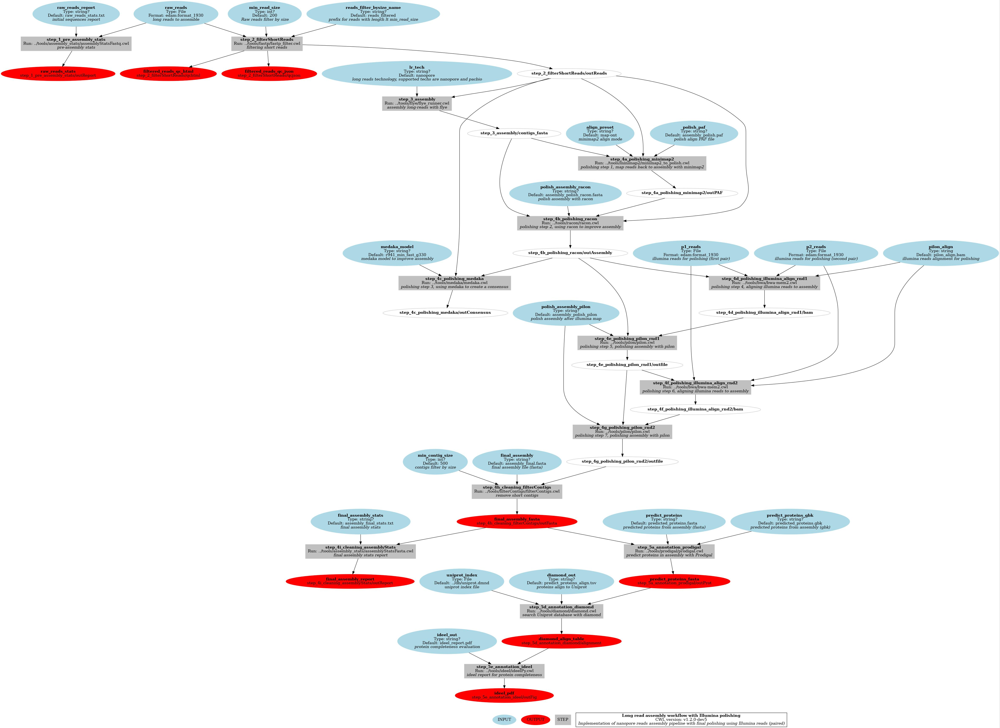

# MGnify-LR Workflow

# Description

This repository contains CWL workflows to assembly metagenomic data from long-reads technologies (Nanopore, PacBio).

Maintainers: MGnify Developers @ EMBL - EBI

# Installation

## Dependencies

1. CWL/Toil
2. Docker or Singularity for container execution or a conda enviroment with all tools installed

# Usage

toil-cwl-runner WORKFLOW CONFIG.yaml

or

cwltool WORKFLOW CONFIG.yaml

# Workflows

## Long-read assembly with Flye
Workflow file: [long_read_assembly.cwl](cwl/workflows/long_read_assembly.cwl)
Example YAML: [long_read_assembly_noHost.yml](cwl/workflows/long_read_assembly.yml)
Description: Long-read data is preprocessed and assembled with Flye, then polishing is applied with Racon, if data is Nanopore, Medaka applies anotehr polishing round. Final steps validate assemblies with gene prediction (Prodigal and comparison of proteins to Uniprot)

## Hybrid assembly (long-read + illumina PE) with metaSPAdes
Workflow file: [hybrid_read_assembly.cwl](cwl/workflows/hybrid_read_assembly.cwl)
Example YAML: [hybrid_read_assembly_noHost.yml](cwl/workflows/hybrid_read_assembly.yml)
Description: Long-read and short-read data is preprocessed and assembled with metaSPAdes, then polishing is applied with 2 Pilon rounds. Final steps validate assemblies with gene prediction (Prodigal and comparison of proteins to Uniprot)

(C) 2021 EMBL - European Bioinformatics Institute