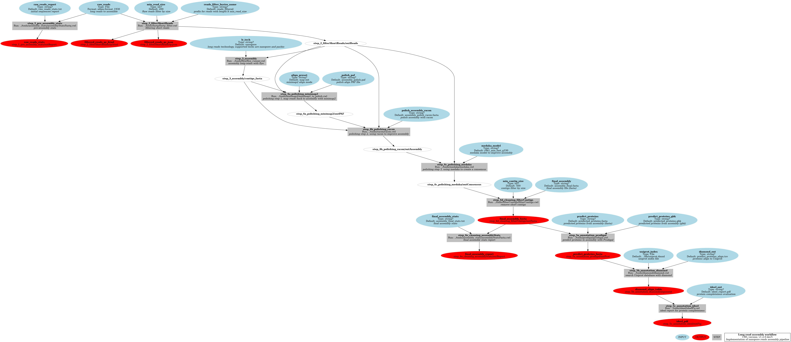
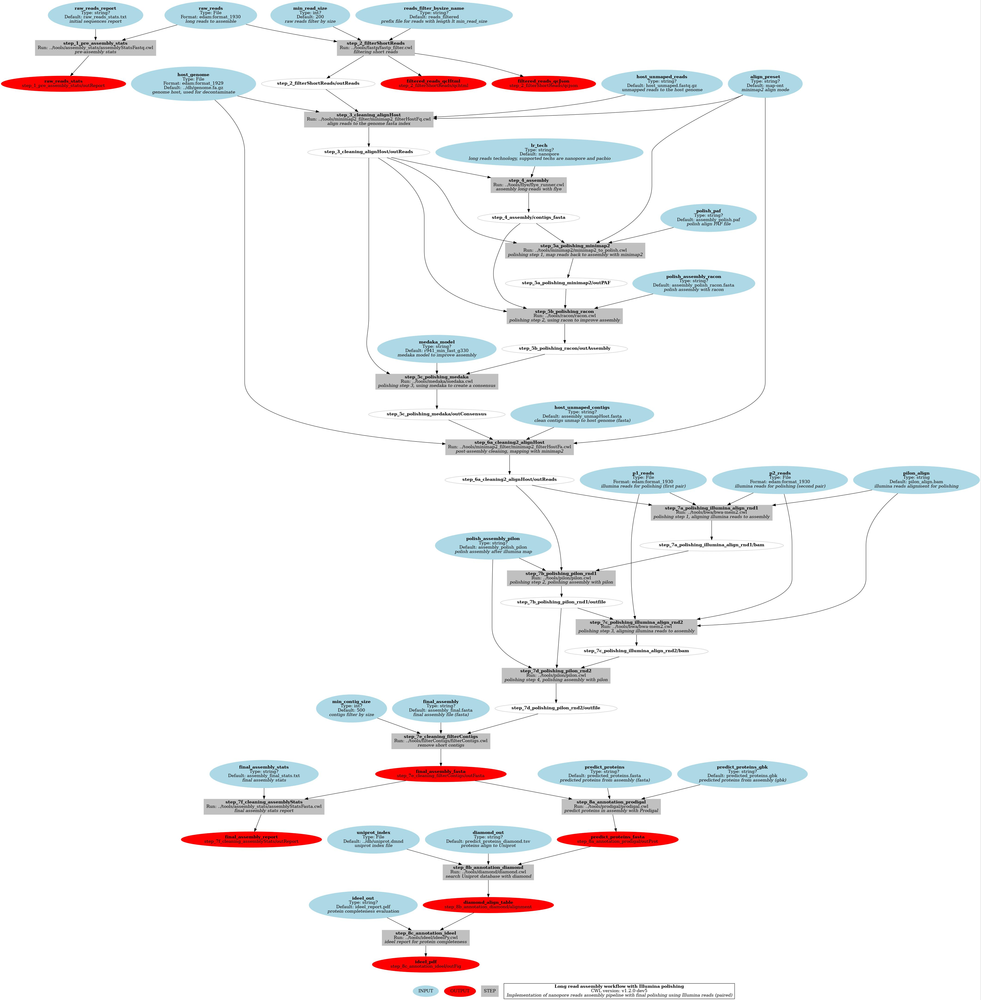
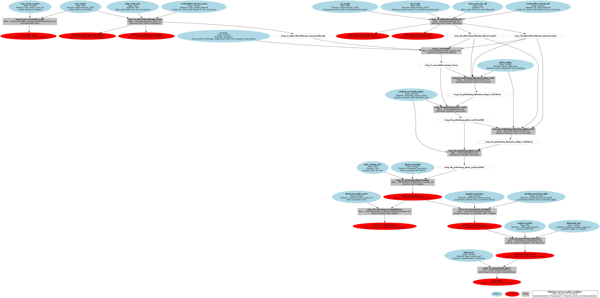
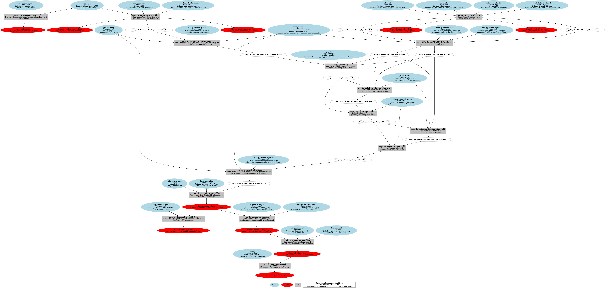

# MGnify-LR Workflow

# Description

This repository contains CWL workflows to assembly metagenomic data from long-reads technologies (Nanopore, PacBio).

Maintainers: MGnify Developers @ EMBL - EBI

# Workflows

## Long-read assembly with Flye

## Long-read assembly with Flye with host decontamination

## Long-read assembly with Flye and polishing

## Long-read assembly with Flye, with polishing and host decontamination

## Hybrid assembly (long-read + illumina PE) with metaSPAdes

## Hybrid assembly (long-read + illumina PE) with metaSPAdes and host decontamination

(C) EMBL - European Bioinformatics Institute